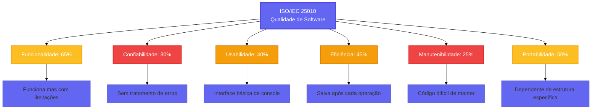

<div align="center">
  
</div>

<div align="center">
  
  [](https://git.io/typing-svg)
  
</div>

<br>

<div align="center">
  
  
  
  
  
</div>

<br>

<div align="center">
  
  ### 🎓 Universidade São Judas Tadeu
  **Gestão e Qualidade de Software | São Paulo - 2025**
  
  👨‍🏫 **Professor:** Robson Calvetti
  
</div>

<br>


<br>

## 👥 Nossa Equipe

<div align="center">

<table>
  <tr>
    <td align="center" width="14%">
      <a href="https://github.com/atr3ssa">
        <br>
        <sub><b>Andressa Rabêlo</b></sub>
      </a><br>
      <sub>RA: 823213904</sub>
    </td>
    <td align="center" width="14%">
      <a href="https://github.com/Julia-Olive">
        <br>
        <sub><b>Júlia Oliveira</b></sub>
      </a><br>
      <sub>RA: 823214680</sub>
    </td>
    <td align="center" width="14%">
      <a href="https://github.com/Marzocca99">
        <br>
        <sub><b>Lucas Marzocca</b></sub>
      </a><br>
      <sub>RA: 823116813</sub>
    </td>
    <td align="center" width="14%">
      <a href="https://github.com/Elmarquitoos">
        <br>
        <sub><b>Marcos V. Santos</b></sub>
      </a><br>
      <sub>RA: 82327399</sub>
    </td>
    <td align="center" width="14%">
      <a href="https://github.com/matheushfg">
        <br>
        <sub><b>Matheus H. F.</b></sub>
      </a><br>
      <sub>RA: 823141914</sub>
    </td>
    <td align="center" width="14%">
      <a href="https://github.com/b3ery">
        <br>
        <sub><b>Mylena Soares</b></sub>
      </a><br>
      <sub>RA: 824144075</sub>
    </td>
    <td align="center" width="14%">
      <a href="https://github.com/samuelcostt">
        <br>
        <sub><b>Samuel Faustino</b></sub>
      </a><br>
      <sub>RA: 824147380</sub>
    </td>
  </tr>
</table>

</div>

<br>


<br>

## 🎯 Sobre o Projeto

Este projeto aplica os princípios do **Clean Code** em um sistema de gerenciamento de biblioteca. O objetivo é transformar um código funcional, mas com diversas más práticas, em um software bem estruturado, testado e manutenível.

**Funcionalidades do Sistema:**
- 📚 Cadastro e gerenciamento de livros
- 👥 Registro de usuários
- 📖 Controle de empréstimos e devoluções
- 💾 Persistência de dados em JSON

<br>

### 📋 Código Original

<details open>
<summary><b>Clique para ver o código completo</b></summary>

```python
import datetime 
import json 

livros = [] 
usuarios = [] 
emprestimos = [] 
contador_livros = 1 
contador_usuarios = 1 

def adicionarLivro(titulo, autor, isbn, ano): 
    global contador_livros 
    
    if titulo == "" or autor == "" or isbn == "": 
        print("Erro: campos obrigatórios") 
        return False 
     
    for livro in livros: 
        if livro['isbn'] == isbn: 
            print("Livro já existe") 
            return False 
     
    if len(isbn) != 13 and len(isbn) != 10: 
        print("ISBN inválido") 
        return False 
     
    l = { 
        'id': contador_livros, 
        'titulo': titulo, 
        'autor': autor, 
        'isbn': isbn, 
        'ano': ano, 
        'disponivel': True 
    } 
     
    livros.append(l) 
    contador_livros += 1 
    print("Livro adicionado com sucesso") 
    salvarDados()
    return True 
 
def cadastrarUsuario(nome, email, telefone): 
    global contador_usuarios 

    if nome == "": 
        print("Nome é obrigatório") 
        return False 
     
    for usuario in usuarios: 
        if usuario['email'] == email: 
            print("Email já cadastrado") 
            return False 
     
    if "@" not in email: 
        print("Email inválido") 
        return False 
     
    u = { 
        'id': contador_usuarios, 
        'nome': nome, 
        'email': email, 
        'telefone': telefone, 
        'ativo': True 
    } 
     
    usuarios.append(u) 
    contador_usuarios += 1 
    print("Usuário cadastrado com sucesso") 
    salvarDados() 
    return True 
 
def realizarEmprestimo(usuario_id, livro_id): 
    u = None 
    l = None 
     
    for usuario in usuarios: 
        if usuario['id'] == usuario_id: 
            u = usuario 
            break 
     
    if u == None: 
        print("Usuário não encontrado") 
        return False 
     
    for livro in livros: 
        if livro['id'] == livro_id: 
            l = livro 
            break 
     
    if l == None: 
        print("Livro não encontrado") 
        return False 
     
    if l['disponivel'] == False: 
        print("Livro não disponível") 
        return False 
     
    data_emprestimo = datetime.datetime.now() 
    data_devolucao = data_emprestimo + datetime.timedelta(days=14) 
     
    emp = { 
        'id': len(emprestimos) + 1,
        'usuario_id': usuario_id, 
        'livro_id': livro_id, 
        'data_emprestimo': data_emprestimo.strftime('%Y-%m-%d'), 
        'data_devolucao': data_devolucao.strftime('%Y-%m-%d'), 
        'devolvido': False 
    } 
     
    emprestimos.append(emp) 
    l['disponivel'] = False 
     
    print("Empréstimo realizado com sucesso") 
    salvarDados() 
    return True 
 
def devolverLivro(emprestimo_id): 
    e = None 
     
    for emprestimo in emprestimos: 
        if emprestimo['id'] == emprestimo_id: 
            e = emprestimo 
            break 
     
    if e['devolvido'] == True: 
        print("Livro já foi devolvido") 
        return False 
     
    for livro in livros: 
        if livro['id'] == e['livro_id']: 
            livro['disponivel'] = True 
            break 
     
    e['devolvido'] = True 
    e['data_devolucao_real'] = datetime.datetime.now().strftime('%Y-%m-%d') 
     
    print("Livro devolvido com sucesso") 
    salvarDados() 
    return True 
 
def listarLivros(): 
    if len(livros) == 0: 
        print("Nenhum livro cadastrado") 
        return 
     
    print("=== LIVROS ===") 
    for livro in livros: 
        status = "Disponível" if livro['disponivel'] else "Emprestado" 
        print(f"ID: {livro['id']} | {livro['titulo']} | {livro['autor']} | {status}") 
 
def listarUsuarios(): 
    if len(usuarios) == 0: 
        print("Nenhum usuário cadastrado") 
        return 
     
    print("=== USUÁRIOS ===") 
    for usuario in usuarios: 
        status = "Ativo" if usuario['ativo'] else "Inativo" 
        print(f"ID: {usuario['id']} | {usuario['nome']} | {usuario['email']} | {status}") 
 
def listarEmprestimos(): 
    if len(emprestimos) == 0: 
        print("Nenhum empréstimo cadastrado") 
        return 
     
    print("=== EMPRÉSTIMOS ===") 
    for emp in emprestimos: 
        status = "Devolvido" if emp['devolvido'] else "Em andamento" 
        print(f"ID: {emp['id']} | Usuário: {emp['usuario_id']} | Livro: {emp['livro_id']} | {status}") 
 
def salvarDados(): 
    dados = { 
        'livros': livros, 
        'usuarios': usuarios, 
        'emprestimos': emprestimos, 
        'contador_livros': contador_livros, 
        'contador_usuarios': contador_usuarios 
    } 
     
    with open('biblioteca.json', 'w') as f: 
        json.dump(dados, f, indent=2) 
 
def carregarDados(): 
    global livros, usuarios, emprestimos, contador_livros, contador_usuarios 
     
    with open('biblioteca.json', 'r') as f: 
        dados = json.load(f) 
        livros = dados['livros'] 
        usuarios = dados['usuarios'] 
        emprestimos = dados['emprestimos'] 
        contador_livros = dados['contador_livros'] 
        contador_usuarios = dados['contador_usuarios'] 
 
def menu(): 
    while True: 
        print("\n=== SISTEMA DE BIBLIOTECA ===") 
        print("1. Adicionar Livro") 
        print("2. Cadastrar Usuário") 
        print("3. Realizar Empréstimo") 
        print("4. Devolver Livro") 
        print("5. Listar Livros") 
        print("6. Listar Usuários") 
        print("7. Listar Empréstimos") 
        print("8. Salvar Dados") 
        print("9. Carregar Dados") 
        print("0. Sair") 
         
        opcao = input("Escolha uma opção: ") 
         
        if opcao == "1": 
            titulo = input("Título: ") 
            autor = input("Autor: ") 
            isbn = input("ISBN: ") 
            ano = int(input("Ano: "))
            adicionarLivro(titulo, autor, isbn, ano) 
        elif opcao == "2": 
            nome = input("Nome: ") 
            email = input("Email: ") 
            telefone = input("Telefone: ") 
            cadastrarUsuario(nome, email, telefone) 
        elif opcao == "3": 
            usuario_id = int(input("ID do Usuário: ")) 
            livro_id = int(input("ID do Livro: ")) 
            realizarEmprestimo(usuario_id, livro_id) 
        elif opcao == "4": 
            emprestimo_id = int(input("ID do Empréstimo: ")) 
            devolverLivro(emprestimo_id) 
        elif opcao == "5": 
            listarLivros() 
        elif opcao == "6": 
            listarUsuarios() 
        elif opcao == "7": 
            listarEmprestimos() 
        elif opcao == "8": 
            salvarDados() 
            print("Dados salvos com sucesso") 
        elif opcao == "9": 
            carregarDados() 
            print("Dados carregados com sucesso") 
        elif opcao == "0": 
            print("Saindo do sistema...") 
            break 
        else: 
            print("Opção inválida") 
 
if __name__ == "__main__": 
    adicionarLivro("1984", "George Orwell", "9780451524935", 1949) 
    adicionarLivro("Dom Casmurro", "Machado de Assis", "9788525406958", 1899) 
    cadastrarUsuario("João Silva", "joao@email.com", "11999999999") 
    cadastrarUsuario("Maria Santos", "maria@email.com", "11888888888") 
     
    menu()
```

</details>

<br>

### 🔍 Principais Problemas Identificados

- **Variáveis Globais:** 5 variáveis globais gerando dependências ocultas
- **Funções Longas:** Métodos com múltiplas responsabilidades
- **Código Duplicado:** Lógica repetida para buscar objetos
- **Nomes Ruins:** Variáveis `l`, `u`, `e` sem significado claro
- **Falta de Tratamento de Exceções:** Operações de arquivo sem try/catch
- **Validações Fracas:** Checagens muito simples (ex: email apenas verifica "@")
- **Acoplamento Alto:** Todas as funções chamam `salvarDados()`
- **Magic Numbers:** Valores hardcoded (13, 10, 14 dias)

<br>

### 📊 Análise de Qualidade ISO/IEC 25010

<div align="center">



<details>
<summary><b>Como foi feita a análise?</b></summary>

<br>

**Metodologia de Avaliação:**

Cada característica da ISO/IEC 25010 foi avaliada através de:

1. **Funcionalidade (65%):** Análise de completude e correção das funcionalidades implementadas
2. **Confiabilidade (30%):** Verificação de tratamento de exceções, recuperação de falhas e robustez
3. **Usabilidade (40%):** Avaliação da interface, mensagens de erro e facilidade de uso
4. **Eficiência (45%):** Análise de performance, uso de recursos e otimização de operações
5. **Manutenibilidade (25%):** Revisão de modularização, complexidade ciclomática e documentação
6. **Portabilidade (50%):** Verificação de dependências externas e facilidade de instalação

A pontuação foi baseada em checklists específicos para cada característica, considerando boas práticas de engenharia de software.

</details>

</div>

<br>

### 🧪 Resultados dos Testes

<div align="center">


Os testes são executados automaticamente via **GitHub Actions** a cada commit. Os badges acima mostram o status em tempo real dos testes e da cobertura de código.

📋 [Ver histórico completo de testes](https://github.com/Julia-Olive/USJT-2025.2-GQS-ProjetoA3/actions)

</div>

<br>


<br>

## 📚 Referências Bibliográficas

<details>
<summary><b>📖 Clique para ver a bibliografia</b></summary>

<br>

**Bibliografia Básica:**

📕 PRESSMAN, Roger; MAXIM, Bruce. **Engenharia de Software: Uma abordagem profissional**. 8ª Ed. Bookman, 2016.

📗 SOMMERVILLE, Ian. **Engenharia de Software**. 9ª ed. São Paulo: Pearson Prentice Hall, 2011.

📘 GONÇALVES, Priscila de Fátima et al. **Testes de software e gerência de configuração**. Soluções Educacionais Integradas, 2019.

<br>

**Bibliografia Complementar:**

📙 MARTIN, Robert C. **Clean Code: A Handbook of Agile Software Craftsmanship**. Prentice Hall, 2008.

📙 MARTIN, Robert C. **Clean Architecture: A Craftsman's Guide to Software Structure and Design**. Prentice Hall, 2017.

📙 FOWLER, Martin. **Refactoring: Improving the Design of Existing Code**. 2ª Ed. Addison-Wesley, 2018.

</details>

<br>


<br>

## 💡 Reflexão

> *"Qualquer tolo consegue escrever código que um computador entende. Bons programadores escrevem código que humanos entendem."*  
> **— Martin Fowler**

<br>

Este projeto demonstra que código limpo não é apenas sobre fazer funcionar, mas sobre criar software que outros desenvolvedores possam entender, manter e evoluir com facilidade.

<br>


<br>

<div align="center">

### 🎓 Universidade São Judas Tadeu

**Gestão e Qualidade de Software - 2025**

<br>


</div>

---

<div align="center">

**📌 Repositório:** [Julia-Olive/USJT-2025.2-GQS-ProjetoA3](https://github.com/Julia-Olive/USJT-2025.2-GQS-ProjetoA3)

</div>
