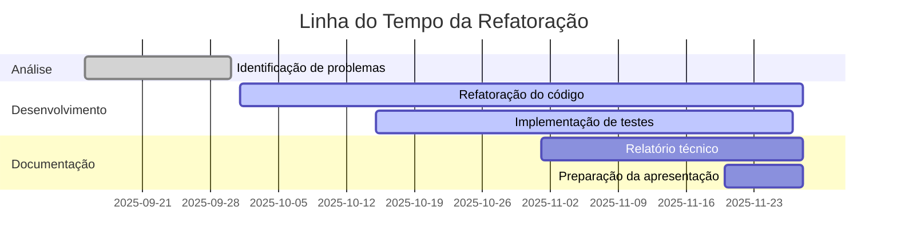

# Refatoração de Código e Clean Code

**Projeto A3 - Gestão e Qualidade de Software**

Universidade São Judas Tadeu | São Paulo, 2025  
Professor: Robson Calvetti

---

## Integrantes

<table>
  <tr>
    <td><b>Andressa Emily Rabêlo Pereira</b> RA: 823213904</td>
    <td><b>Júlia Oliveira Rocha</b> RA: 823214680</td>
    <td><b>Lucas Marzocca</b> RA: 823116813</td>
  </tr>
  <tr>
    <td><b>Marcos V. Santos</b> RA: 82327399</td>
    <td><b>Matheus H. F. Guimarães</b> RA: 823141914</td>
    <td><b>Mylena Soares Rocha</b> RA: 824144075</td>
  </tr>
  <tr>
    <td colspan="3" align="center"><b>Samuel Faustino Gomes da Costa</b> RA: 824147380</td>
  </tr>
</table>

 

## Sobre o Projeto

<b>Qual é o objetivo?</b>

 
Transformar um código legado cheio de más práticas em um software limpo, organizado e fácil de manter. Vamos aplicar os princípios do Clean Code para melhorar a qualidade sem quebrar a funcionalidade original.

<b>O que vamos refatorar?</b>

 
Um sistema simples de cadastro de usuários em Python que apresenta diversos problemas de qualidade. O código funciona, mas está difícil de entender, manter e expandir.

<b>Quais problemas identificamos?</b>

 

**Problemas no código original:**
- Variáveis globais espalhadas pelo código
- Tratamento de exceções muito genérico
- Mensagens e lógica duplicadas
- Falta de organização em classes
- Não há validação de dados duplicados
- Uso inadequado de estruturas de repetição
- Ausência de testes automatizados

 

## Métricas de Qualidade

### Comparativo: Antes vs Depois

| Métrica | Código Original | Código Refatorado | Melhoria |
|---------|----------------|-------------------|----------|
| Linhas de código | - | - | - |
| Complexidade ciclomática | - | - | - |
| Cobertura de testes | 0% | - | - |
| Duplicação de código | Alta | Baixa | - |
| Modularização | Nenhuma | Classes + Métodos | - |

*Métricas serão atualizadas conforme o desenvolvimento*

 

## Princípios Aplicados

<table>
<tr>
<td width="25%" align="center">

**SOLID**

Princípios de design orientado a objetos para código mais flexível e manutenível

</td>
<td width="25%" align="center">

**DRY**

Don't Repeat Yourself - eliminação de código duplicado

</td>
<td width="25%" align="center">

**KISS**

Keep It Simple - código simples e direto ao ponto

</td>
<td width="25%" align="center">

**YAGNI**

You Aren't Gonna Need It - sem complexidade desnecessária

</td>
</tr>
</table>

 

## Evolução do Projeto

 

## Atividade dos Contribuidores

*Substitua SEU-USUARIO/SEU-REPOSITORIO pelo nome real do repositório*

 

## Tecnologias

 

## Como Contribuir

Cada membro do grupo deve fazer pelo menos um commit. Para contribuir:

1. Clone o repositório
2. Crie uma branch com seu nome: `git checkout -b feature/seu-nome`
3. Faça suas alterações
4. Commit suas mudanças: `git commit -m "Descrição clara do que foi feito"`
5. Push para o GitHub: `git push origin feature/seu-nome`
6. Abra um Pull Request

 

---

**Universidade São Judas Tadeu**  
Gestão e Qualidade de Software - 2025

*"Qualquer tolo consegue escrever código que um computador entende. Bons programadores escrevem código que humanos entendem."* - Martin Fowler

